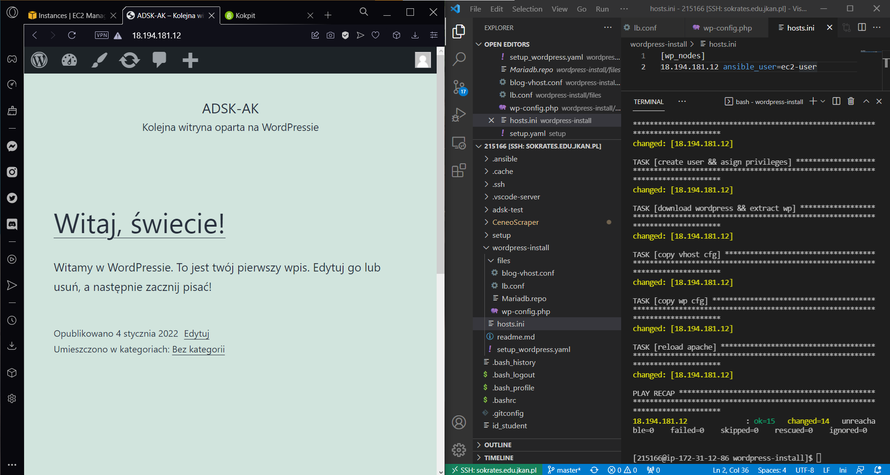

# Wordpress Ansible Automation
## Instalacja
1. Utworzenie maszyny wirtualnej z wykorzystaniem AWS
2. Połączenie z sokrates.edu.jkan.pl
3. Utworzenie `hosts.ini` deklarującego IP utworzonej maszyny wirtualnej
4. Utworzenie folderu ``files`` zawierającego pliki konfiguracyjne: `blog-vhost.conf`, `lb.conf`, `Mariadb.repo`, `wp-config.php`
5. Utworzenie pliku `setup_wordpress.yaml`

## Zawartość pliku setup_wordpress.yaml
- Deklaracja zmiennych
- Instalacja HTTP Server
- Instalacja PHP repository & packages
- Skopiowanie oraz instalacja Mariadb repository
- Instalacja modułu MySQL
- Utworzenie bazy danych
- Deklaracja dostępu użytkowników
- Instalacja WordPress oraz plików konfiguracyjnych

## Rezultat
Komenda wywołania instalacji:
```
ansible-playbook setup_wordpress.yaml -i hosts.ini
```
Wynik:

